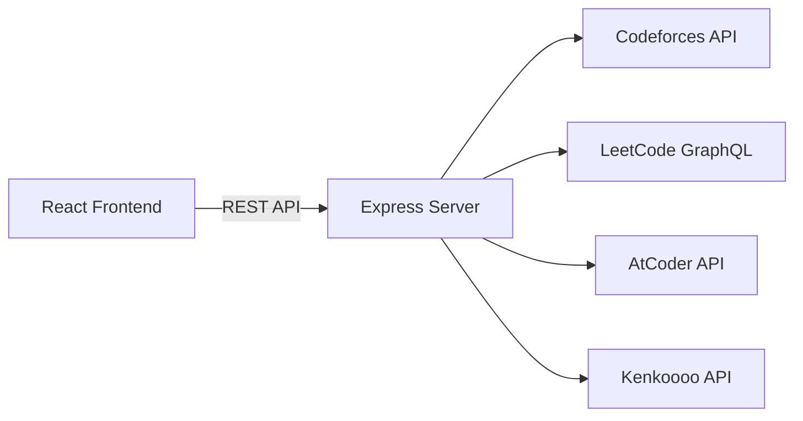

<div align="center">

# ⚔️ AlgoForge

**Competitive Programming Analytics & Recommendation Engine**

Track your ratings, uncover weak topics, and get smart problem recommendations — all from one dashboard.

[](https://react.dev)
[](https://vitejs.dev)
[](https://expressjs.com)

</div>

---

## 📖 Overview

AlgoForge is a full-stack web application that aggregates your competitive programming profiles from **Codeforces**, **LeetCode**, and **AtCoder** into a unified dashboard. It analyzes your submission history to identify weak problem tags, computes a personalized "growth zone" based on your current rating, and recommends curated problems to help you improve where it matters most.

---

## ✨ Features

### 📊 Progress Dashboard
- Enter handles for **Codeforces**, **LeetCode**, and **AtCoder**
- View current rating, peak rating, rank, and solved count per platform
- Aggregate stats: total problems solved, peak rating across platforms, and strongest platform
- Handles persist in `localStorage` across sessions

### 🔍 Weakness Analyzer
- Fetches your Codeforces submission history (up to 1,000 submissions)
- Groups problems by tag and computes **per-tag success rates**
- Highlights your **weakest valid tag** (minimum 3 attempts threshold)
- Computes a **growth zone** rating band: `[currentRating - 100, currentRating + 300]`
- Visual progress bars color-coded by performance (green ≥ 70%, yellow ≥ 40%, red < 40%)

### 🎯 Smart Recommendations
- Automatically targets your weakest tag
- Pulls problems from the Codeforces problemset filtered by tag + growth zone rating range
- Ranks recommendations by community solve count (most popular first)
- Direct links to each problem on Codeforces

---

## 🏗️ Architecture

```
AlgoForge/
├── frontend/          ← React + Vite SPA
│   └── src/
│       ├── api/       ← API client (fetch wrapper)
│       ├── components/← Reusable UI (Sidebar)
│       ├── pages/     ← Dashboard, TagAnalyzer, Recommendations
│       └── main.jsx   ← Router setup
│
└── server/            ← Express REST API
    ├── routes/        ← Platform, Analyze, Recommendations endpoints
    ├── services/      ← Codeforces, LeetCode, AtCoder API integrations
    └── server.js      ← Entry point & middleware
```



---

## 🛠️ Tech Stack

| Layer     | Technology                                                    |
| --------- | ------------------------------------------------------------- |
| Frontend  | React 19, React Router 7, Framer Motion, React Icons, Vite 8 |
| Backend   | Node.js, Express 4, ES Modules                               |
| APIs      | Codeforces REST, LeetCode GraphQL, AtCoder + Kenkoooo        |
| Dev Tools | Nodemon, ESLint, Vite dev proxy                              |

---

## 🚀 Getting Started

### Prerequisites

- **Node.js** ≥ 18
- **npm** ≥ 9

### 1. Clone the repository

```bash
git clone https://github.com/your-username/AlgoForge.git
cd AlgoForge
```

### 2. Set up the backend

```bash
cd server
npm install
```

Create a `.env` file (or edit the existing one):

```env
PORT=5001
```

Start the server:

```bash
npm run dev     # with hot-reload (nodemon)
# or
npm start       # production mode
```

The API will be available at `http://localhost:5001`.

### 3. Set up the frontend

```bash
cd frontend
npm install
npm run dev
```

The app will open at `http://localhost:5173` with API requests proxied to the backend.

### 4. Build for production

```bash
cd frontend
npm run build       # outputs to frontend/dist/
npm run preview     # preview the production build locally
```

---

## 📡 API Reference

All endpoints are prefixed with `/api`.

### Health Check

| Method | Endpoint       | Description            |
| ------ | -------------- | ---------------------- |
| `GET`  | `/api/health`  | Service status & uptime |

### Platform Profiles

| Method | Endpoint                           | Description                        |
| ------ | ---------------------------------- | ---------------------------------- |
| `GET`  | `/api/platforms/codeforces/:handle`| Fetch Codeforces profile           |
| `GET`  | `/api/platforms/leetcode/:handle`  | Fetch LeetCode profile             |
| `GET`  | `/api/platforms/atcoder/:handle`   | Fetch AtCoder profile              |
| `POST` | `/api/platforms/all`               | Fetch all platforms in parallel    |

**POST `/api/platforms/all`** — Request Body:
```json
{
  "codeforces": "tourist",
  "leetcode": "neal_wu",
  "atcoder": "tourist"
}
```

### Tag Analysis

| Method | Endpoint        | Description                                |
| ------ | --------------- | ------------------------------------------ |
| `POST` | `/api/analyze`  | Analyze submissions & compute tag stats    |

**Request Body:**
```json
{
  "codeforces": "your_handle",
  "leetcode": "your_handle"
}
```

**Response** includes `tagStats`, `growthZone`, `weakestTag`, and submission counts.

### Recommendations

| Method | Endpoint               | Description                               |
| ------ | ---------------------- | ----------------------------------------- |
| `POST` | `/api/recommendations` | Get recommended problems for weakest tag  |

**Request Body:**
```json
{
  "weakestTag": "dp",
  "growthZone": { "lower": 1300, "upper": 1700 },
  "limit": 6
}
```

---

## 🗂️ Project Structure

```
server/
├── server.js                  # Express app, middleware, route mounting
├── routes/
│   ├── platforms.js           # Individual + bulk profile endpoints
│   ├── analyze.js             # Tag analysis endpoint
│   └── recommendations.js     # Problem recommendation endpoint
├── services/
│   ├── codeforces.js          # CF profile, submissions, problemset
│   ├── leetcode.js            # LC GraphQL profile & submissions
│   ├── atcoder.js             # AC rating history & solved count
│   └── analyzer.js            # Tag stats, growth zone, weakest tag
└── .env                       # Environment variables (PORT)

frontend/src/
├── main.jsx                   # React root, BrowserRouter, routes
├── App.jsx                    # Layout shell (Sidebar + animated Outlet)
├── api/
│   └── client.js              # API client with fetch wrapper
├── components/
│   └── Sidebar.jsx            # Navigation sidebar
├── pages/
│   ├── Dashboard.jsx          # Multi-platform profile dashboard
│   ├── TagAnalyzer.jsx        # Submission weakness analyzer
│   └── Recommendations.jsx    # Smart problem recommendations
├── index.css                  # Global styles & design system
└── App.css                    # Layout-specific styles
```

---

## 🌐 Deployment

The app is configured for deployment with the frontend on **Vercel** and the backend on any Node.js hosting platform.

- **Frontend**: The production build is a static SPA in `frontend/dist/`. The Vercel origin is already whitelisted in the CORS config.
- **Backend**: Set the `PORT` environment variable and run `npm start`.
- Set `VITE_API_URL` in the frontend's `.env.production` to point to your deployed backend URL.

---

## 🤝 Contributing

1. Fork the repository
2. Create a feature branch (`git checkout -b feature/awesome-feature`)
3. Commit your changes (`git commit -m 'Add awesome feature'`)
4. Push to the branch (`git push origin feature/awesome-feature`)
5. Open a Pull Request

---

<div align="center">
  <sub>Built with ☕ and a passion for competitive programming</sub>
</div>
